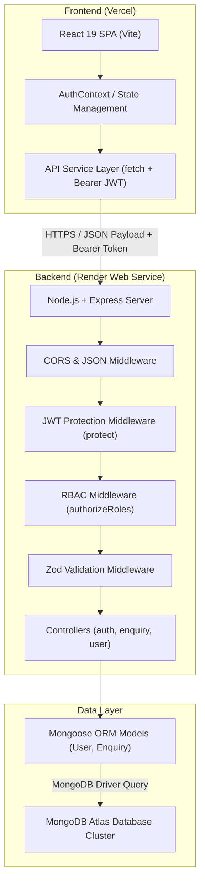
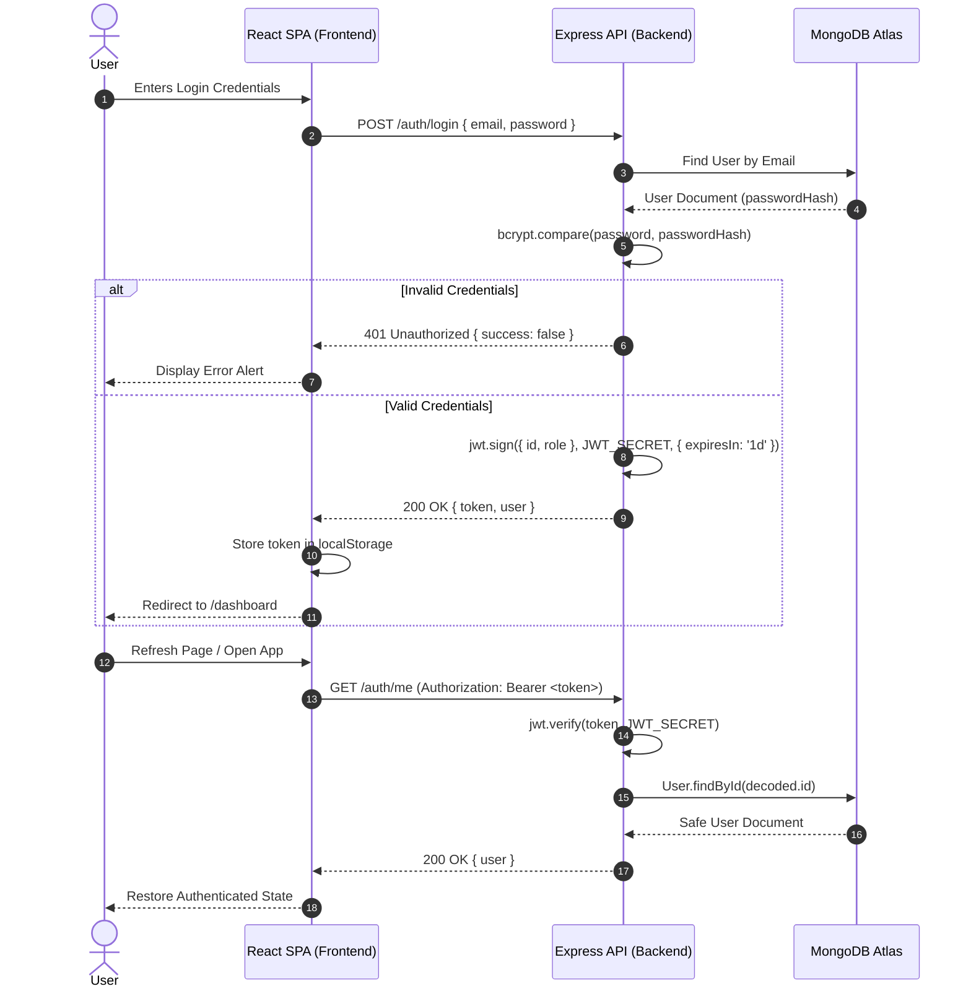
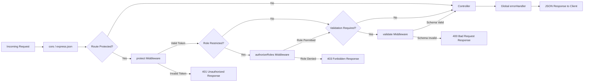

# CloudBlitz System Architecture

Technical Architecture and System Design Specification for the CloudBlitz Enquiry Management System.

---

## 📖 Table of Contents

- [High-Level Architecture Diagram](#-high-level-architecture-diagram)
- [End-to-End Component Flow](#-end-to-end-component-flow)
- [Authentication & JWT Lifecycle](#-authentication--jwt-lifecycle)
- [Middleware Execution Pipeline](#-middleware-execution-pipeline)
- [Validation Architecture](#-validation-architecture)
- [MVC Data Pattern](#-mvc-data-pattern)
- [Production Deployment Topology](#-production-deployment-topology)

---

## 🏗️ High-Level Architecture Diagram



---

## 🔄 End-to-End Component Flow

1. **User Interaction**: Users interact with the React Single Page Application (SPA) compiled by Vite.
2. **HTTP Communication**: Requests are formatted by `Frontend/src/services/api.js` using standard `fetch` API.
3. **Authentication Header**: If an active token exists in `localStorage` (`cloudblitz_auth_token`), it is automatically attached as an `Authorization: Bearer <TOKEN>` header.
4. **Backend Processing**:
   - `Backend/src/app.js` parses incoming JSON and applies CORS controls.
   - Authentication middleware (`protect`) decodes and verifies the JWT token using `JWT_SECRET`.
   - Role authorization (`authorizeRoles`) validates permissions (`admin` vs `staff`).
   - Zod validation middleware validates input schema compatibility.
   - Controllers handle business logic and perform CRUD operations via Mongoose ORM models (`User`, `Enquiry`).
5. **Database Persistence**: MongoDB Atlas executes query requests over encrypted TLS connections.

---

## 🔐 Authentication & JWT Lifecycle



---

## 🛡️ Middleware Execution Pipeline

All incoming protected API requests execute through a strict, sequential middleware pipeline:



---

## 📐 Validation Architecture

Requests requiring input validation pass through a generic, reusable Express middleware factory `Backend/src/middlewares/validate.js`:

```javascript
export const validate = (schema) => async (req, res, next) => {
  try {
    const parsed = await schema.parseAsync(req.body);
    req.body = parsed;
    next();
  } catch (error) {
    if (error.name === "ZodError" || error.issues) {
      const formattedErrors = (error.issues || []).map((err) => ({
        field: err.path.join("."),
        message: err.message,
      }));

      return res.status(400).json({
        success: false,
        message: formattedErrors[0]?.message || "Validation failed",
        errors: formattedErrors,
      });
    }
    next(error);
  }
};
```

This guarantees that controllers receive clean, parsed, and validated data objects.

---

## 🧩 MVC Data Pattern

The backend maintains strict Separation of Concerns:

- **Routes (`Backend/src/routes/`)**: Map HTTP paths and HTTP verbs to appropriate middleware stacks and controllers.
- **Validators (`Backend/src/validators/`)**: Define strict Zod schema constraints.
- **Middlewares (`Backend/src/middlewares/`)**: Perform non-functional cross-cutting concerns (Authentication, Authorization, Logging, Parsing, Error Handling).
- **Controllers (`Backend/src/controllers/`)**: Encapsulate request lifecycle handling, response status codes, and error forwarding (`next(error)`).
- **Models (`Backend/src/models/`)**: Define Mongoose schemas, indexes, soft-delete fields (`isDeleted`), and JSON transforms (`delete ret.passwordHash`).

---

## 🌐 Production Deployment Topology

```mermaid
graph LR
    User Browser -->|HTTPS| Vercel[Vercel Global Edge CDN]
    Vercel -->|Renders SPA| FrontendApp[React Static App]
    FrontendApp -->|API Requests| Render[Render Web Service]
    Render -->|TLS Encrypted Connection| MongoAtlas[(MongoDB Atlas Database)]
```

- **Frontend Hosting (Vercel)**: Serves static compiled React assets over edge CDN. `vercel.json` rewrites all client route paths to `index.html` for single-page client routing.
- **Backend Hosting (Render)**: Hosts the Express server as an auto-managed HTTPS Node.js service.
- **Database Hosting (MongoDB Atlas)**: Managed MongoDB cloud database with TLS transport encryption and network IP security controls.
